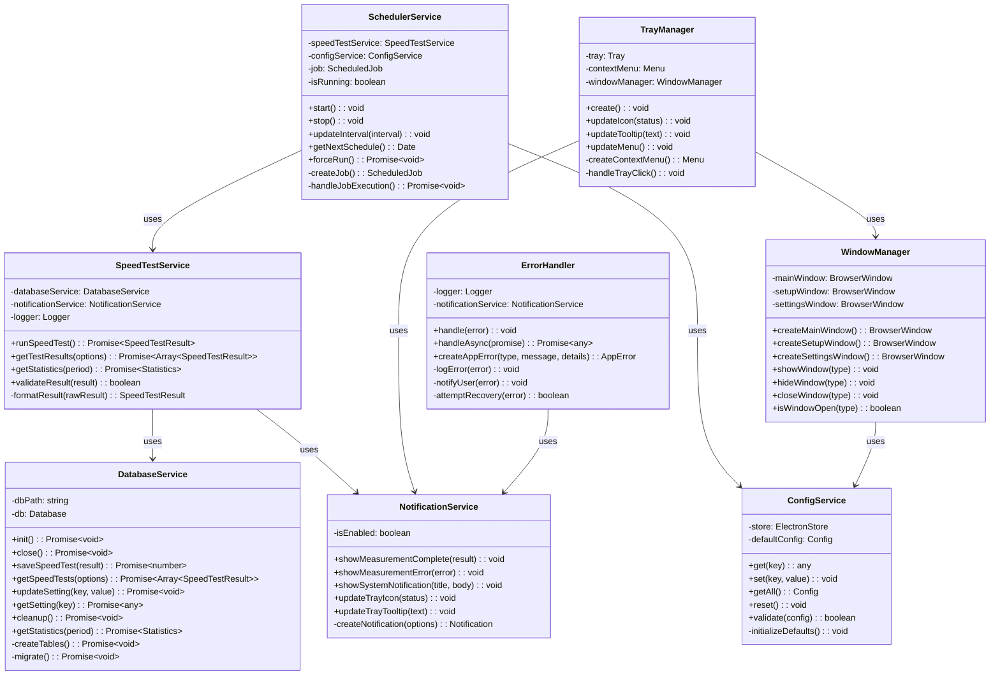
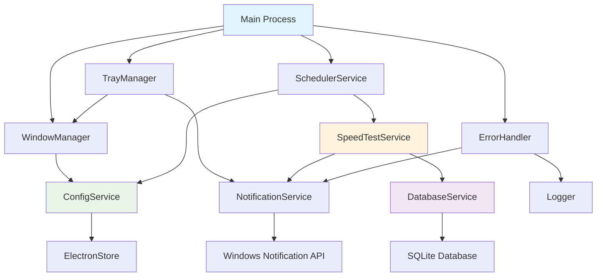
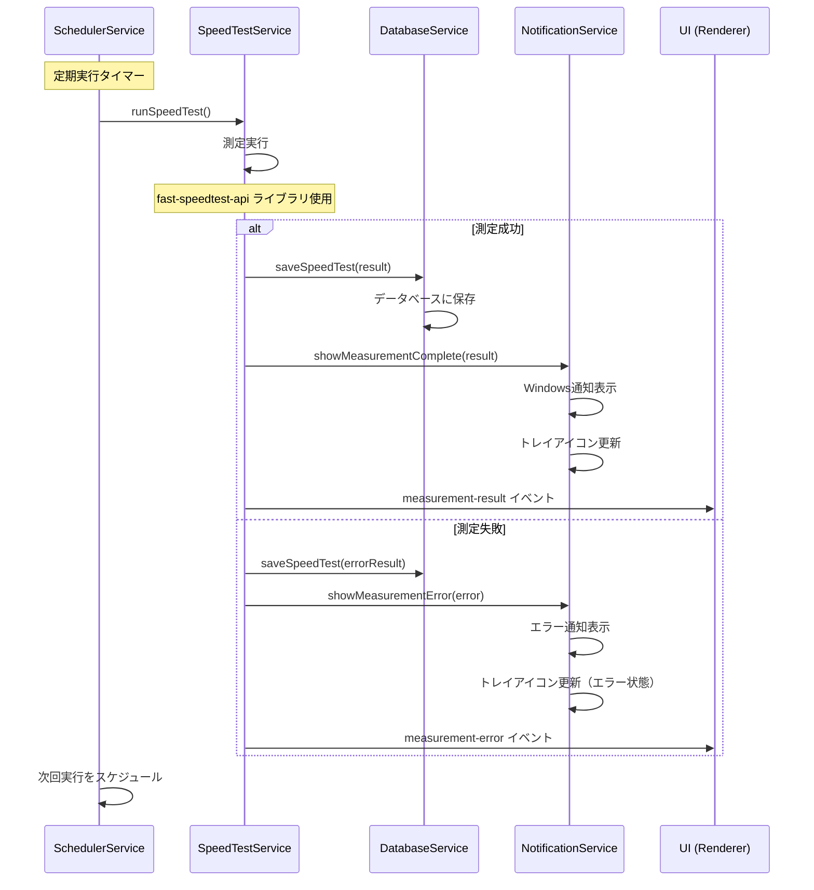
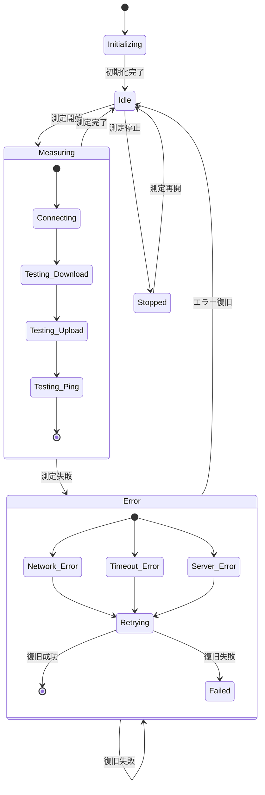

# 通信速度測定アプリ - 設計書

この設計書は、SpeedTest Monitorの技術的な設計詳細を記述します。要件定義は[requirement.md](requirement.md)、開発ガイドは[CLAUDE.md](../CLAUDE.md)を参照してください。

## 1. システム概要

### 1.1 アーキテクチャ概要
```
┌─────────────────────────────────────┐
│           Electron App              │
├─────────────────────────────────────┤
│  Main Process (main.js)             │
│  ├─ Window Management               │
│  ├─ Tray Management                 │
│  ├─ Scheduler Service               │
│  └─ IPC Communication              │
├─────────────────────────────────────┤
│  Renderer Process                   │
│  ├─ Setup Window                    │
│  ├─ Dashboard Window                │
│  └─ Settings Window                 │
├─────────────────────────────────────┤
│  Services Layer                     │
│  ├─ SpeedTest Service               │
│  ├─ Database Service                │
│  ├─ Notification Service            │
│  └─ Config Service                  │
├─────────────────────────────────────┤
│  Data Layer                         │
│  ├─ SQLite Database                 │
│  └─ Config Files                    │
└─────────────────────────────────────┘
```

### 1.2 技術スタック
- **Framework**: Electron (Latest LTS)
- **Runtime**: Node.js 18.x+
- **Database**: SQLite3
- **UI Framework**: Bootstrap 5
- **Charts**: Chart.js
- **Build Tool**: electron-builder
- **Package Manager**: npm

## 2. モジュール設計

### 2.1 ディレクトリ構造
```
speedtest-monitor/
├── package.json
├── main.js
├── preload.js
├── assets/
│   ├── icons/
│   │   ├── icon.ico
│   │   ├── tray-idle.ico
│   │   ├── tray-active.ico
│   │   └── tray-error.ico
│   └── logo.png
├── src/
│   ├── renderer/
│   │   ├── pages/
│   │   │   ├── setup.html
│   │   │   ├── dashboard.html
│   │   │   └── settings.html
│   │   ├── js/
│   │   │   ├── setup.js
│   │   │   ├── dashboard.js
│   │   │   ├── settings.js
│   │   │   └── chart-utils.js
│   │   └── css/
│   │       ├── main.css
│   │       └── components.css
│   ├── services/
│   │   ├── speedtest-service.js
│   │   ├── database-service.js
│   │   ├── scheduler-service.js
│   │   ├── notification-service.js
│   │   └── config-service.js
│   └── utils/
│       ├── logger.js
│       ├── constants.js
│       └── helpers.js
├── build/
│   └── installer.nsh
└── dist/
    └── (build output)
```

### 2.2 依存関係定義
```json
{
  "dependencies": {
    "fast-speedtest-api": "^0.3.2",
    "sqlite3": "^5.1.6",
    "electron-store": "^8.1.0",
    "node-schedule": "^2.1.1",
    "electron-log": "^4.4.8"
  },
  "devDependencies": {
    "electron": "^26.0.0",
    "electron-builder": "^24.6.4",
    "electron-rebuild": "^3.2.9"
  }
}
```

## 3. データベース設計

### 3.1 テーブル定義

#### speed_tests テーブル
```sql
CREATE TABLE speed_tests (
    id INTEGER PRIMARY KEY AUTOINCREMENT,
    timestamp DATETIME NOT NULL DEFAULT CURRENT_TIMESTAMP,
    download_speed REAL NOT NULL,
    upload_speed REAL NOT NULL,
    ping REAL NOT NULL,
    jitter REAL,
    server_name TEXT,
    server_location TEXT,
    server_country TEXT,
    isp TEXT,
    status TEXT NOT NULL DEFAULT 'completed',
    error_message TEXT,
    created_at DATETIME DEFAULT CURRENT_TIMESTAMP
);
```

#### settings テーブル
```sql
CREATE TABLE settings (
    key TEXT PRIMARY KEY,
    value TEXT NOT NULL,
    description TEXT,
    updated_at DATETIME DEFAULT CURRENT_TIMESTAMP
);
```

#### application_logs テーブル
```sql
CREATE TABLE application_logs (
    id INTEGER PRIMARY KEY AUTOINCREMENT,
    level TEXT NOT NULL,
    message TEXT NOT NULL,
    details TEXT,
    timestamp DATETIME DEFAULT CURRENT_TIMESTAMP
);
```

### 3.2 初期データ
```sql
INSERT INTO settings (key, value, description) VALUES
('measurement_interval', '3600', '測定間隔（秒）'),
('auto_start', 'true', '自動起動設定'),
('data_retention_days', '30', 'データ保持期間（日）'),
('notification_enabled', 'true', '通知機能有効'),
('first_run', 'true', '初回起動フラグ');
```

## 4. API設計

### 4.1 IPC通信設計

#### Main → Renderer
```javascript
// 測定結果通知
ipcMain.send('speedtest-result', {
  id: number,
  timestamp: string,
  download: number,
  upload: number,
  ping: number,
  status: 'completed' | 'error'
});

// 設定変更通知
ipcMain.send('settings-updated', {
  key: string,
  value: any
});

// 測定状態通知
ipcMain.send('measurement-status', {
  status: 'idle' | 'running' | 'error',
  nextMeasurement: string
});
```

#### Renderer → Main
```javascript
// 測定開始要求
ipcRenderer.invoke('start-measurement');

// 設定更新要求
ipcRenderer.invoke('update-setting', { key: string, value: any });

// データ取得要求
ipcRenderer.invoke('get-speedtest-data', {
  startDate: string,
  endDate: string,
  limit: number
});

// データエクスポート要求
ipcRenderer.invoke('export-data', {
  format: 'csv',
  dateRange: { start: string, end: string }
});
```

### 4.2 サービスクラス設計

#### クラス図


#### サービス依存関係図


#### データフロー図


#### 状態管理図


## 5. ユーザーインターフェース設計

### 5.1 画面構成

#### セットアップ画面（setup.html）
```html
<div class="setup-container">
  <div class="step-indicator"></div>
  <div class="step-content">
    <!-- Step 1: Welcome -->
    <!-- Step 2: Interval Setting -->
    <!-- Step 3: Auto Start Setting -->
    <!-- Step 4: Complete -->
  </div>
  <div class="step-navigation">
    <button class="btn-prev">戻る</button>
    <button class="btn-next">次へ</button>
  </div>
</div>
```

#### ダッシュボード画面（dashboard.html）
```html
<div class="dashboard">
  <header class="app-header">
    <h1>SpeedTest Monitor</h1>
    <div class="status-indicator"></div>
  </header>
  
  <main class="dashboard-main">
    <div class="status-cards">
      <div class="card current-status"></div>
      <div class="card latest-result"></div>
      <div class="card statistics"></div>
    </div>
    
    <div class="chart-section">
      <canvas id="speedChart"></canvas>
    </div>
    
    <div class="controls">
      <button id="startMeasurement">測定開始</button>
      <button id="stopMeasurement">測定停止</button>
      <button id="exportData">データエクスポート</button>
      <button id="openSettings">設定</button>
    </div>
  </main>
</div>
```

#### 設定画面（settings.html）
```html
<div class="settings">
  <h2>設定</h2>
  
  <div class="setting-group">
    <label>測定間隔</label>
    <select id="measurementInterval">
      <option value="900">15分</option>
      <option value="1800">30分</option>
      <option value="3600">1時間</option>
      <option value="7200">2時間</option>
      <option value="21600">6時間</option>
      <option value="86400">24時間</option>
    </select>
  </div>
  
  <div class="setting-group">
    <label>自動起動</label>
    <input type="checkbox" id="autoStart">
  </div>
  
  <div class="setting-group">
    <label>データ保持期間</label>
    <input type="number" id="retentionDays" min="1" max="365">
    <span>日</span>
  </div>
  
  <div class="setting-group">
    <label>通知</label>
    <input type="checkbox" id="notificationEnabled">
  </div>
  
  <div class="button-group">
    <button id="saveSettings">保存</button>
    <button id="resetSettings">リセット</button>
  </div>
</div>
```

### 5.2 タスクトレイ設計

#### コンテキストメニュー
```javascript
const contextMenu = Menu.buildFromTemplate([
  {
    label: '結果を表示',
    click: () => showMainWindow()
  },
  {
    label: '今すぐ測定',
    click: () => startMeasurement()
  },
  { type: 'separator' },
  {
    label: '測定開始',
    id: 'start',
    click: () => startScheduler()
  },
  {
    label: '測定停止',
    id: 'stop',
    click: () => stopScheduler()
  },
  { type: 'separator' },
  {
    label: '設定',
    click: () => showSettingsWindow()
  },
  {
    label: 'バージョン情報',
    click: () => showAboutDialog()
  },
  { type: 'separator' },
  {
    label: '終了',
    click: () => app.quit()
  }
]);
```

#### アイコン状態管理
```javascript
const TRAY_ICONS = {
  IDLE: 'assets/icons/tray-idle.ico',
  ACTIVE: 'assets/icons/tray-active.ico',
  ERROR: 'assets/icons/tray-error.ico'
};

function updateTrayIcon(status) {
  const iconPath = TRAY_ICONS[status];
  tray.setImage(iconPath);
  
  const tooltip = {
    IDLE: 'SpeedTest Monitor - 待機中',
    ACTIVE: 'SpeedTest Monitor - 測定中',
    ERROR: 'SpeedTest Monitor - エラー'
  };
  
  tray.setToolTip(tooltip[status]);
}
```

## 6. 状態管理設計

### 6.1 アプリケーション状態
```javascript
const AppState = {
  scheduler: {
    isRunning: false,
    nextMeasurement: null,
    currentMeasurement: null
  },
  
  measurement: {
    status: 'idle', // 'idle' | 'running' | 'error'
    progress: 0,
    result: null
  },
  
  settings: {
    measurementInterval: 3600,
    autoStart: true,
    dataRetentionDays: 30,
    notificationEnabled: true,
    firstRun: true
  },
  
  ui: {
    currentWindow: null,
    trayStatus: 'idle'
  }
};
```

### 6.2 イベント管理
```javascript
const EventEmitter = require('events');

class AppEventManager extends EventEmitter {
  constructor() {
    super();
    this.setupEventHandlers();
  }
  
  setupEventHandlers() {
    this.on('measurement-started', this.handleMeasurementStarted);
    this.on('measurement-completed', this.handleMeasurementCompleted);
    this.on('measurement-error', this.handleMeasurementError);
    this.on('settings-changed', this.handleSettingsChanged);
  }
}
```

## 7. エラーハンドリング設計

### 7.1 エラー分類
```javascript
const ErrorTypes = {
  NETWORK_ERROR: 'NETWORK_ERROR',
  DATABASE_ERROR: 'DATABASE_ERROR',
  MEASUREMENT_ERROR: 'MEASUREMENT_ERROR',
  CONFIG_ERROR: 'CONFIG_ERROR',
  UI_ERROR: 'UI_ERROR'
};

class AppError extends Error {
  constructor(type, message, details = null) {
    super(message);
    this.type = type;
    this.details = details;
    this.timestamp = new Date().toISOString();
  }
}
```

### 7.2 エラー処理フロー
```javascript
class ErrorHandler {
  static handle(error) {
    // ログ記録
    Logger.error(error);
    
    // ユーザー通知
    if (error.type === ErrorTypes.NETWORK_ERROR) {
      NotificationService.showError('ネットワークエラーが発生しました');
    }
    
    // 自動復旧
    if (error.type === ErrorTypes.MEASUREMENT_ERROR) {
      SchedulerService.scheduleRetry();
    }
    
    // データベース記録
    DatabaseService.logError(error);
  }
}
```

## 8. ビルド・配布設計

### 8.1 electron-builder設定
```json
{
  "build": {
    "appId": "com.speedtest.monitor",
    "productName": "SpeedTest Monitor",
    "directories": {
      "output": "dist"
    },
    "files": [
      "main.js",
      "preload.js",
      "src/**/*",
      "assets/**/*",
      "node_modules/**/*"
    ],
    "win": {
      "target": {
        "target": "nsis",
        "arch": ["x64"]
      },
      "icon": "assets/icons/icon.ico",
      "requestedExecutionLevel": "asInvoker"
    },
    "nsis": {
      "oneClick": false,
      "allowToChangeInstallationDirectory": true,
      "createDesktopShortcut": true,
      "createStartMenuShortcut": true,
      "shortcutName": "SpeedTest Monitor"
    }
  }
}
```

### 8.2 インストーラーカスタマイズ
```nsi
; installer.nsh
!macro customInstall
  ; レジストリ設定
  WriteRegStr HKLM "Software\SpeedTestMonitor" "InstallPath" "$INSTDIR"
  
  ; ファイアウォール例外設定
  ExecWait 'netsh advfirewall firewall add rule name="SpeedTest Monitor" dir=in action=allow program="$INSTDIR\SpeedTest Monitor.exe"'
!macroend

!macro customUnInstall
  ; レジストリ削除
  DeleteRegKey HKLM "Software\SpeedTestMonitor"
  
  ; ユーザーデータ削除確認
  MessageBox MB_YESNO "ユーザーデータも削除しますか？" IDNO skip_userdata
  RMDir /r "$APPDATA\SpeedTestMonitor"
  skip_userdata:
!macroend
```

## 9. セキュリティ設計

### 9.1 セキュリティ設定
```javascript
// preload.js
const { contextBridge, ipcRenderer } = require('electron');

contextBridge.exposeInMainWorld('electronAPI', {
  // 安全なAPI公開
  startMeasurement: () => ipcRenderer.invoke('start-measurement'),
  getSettings: () => ipcRenderer.invoke('get-settings'),
  updateSetting: (key, value) => ipcRenderer.invoke('update-setting', key, value),
  
  // イベントリスナー
  onMeasurementResult: (callback) => {
    ipcRenderer.on('measurement-result', callback);
  }
});
```

### 9.2 データ保護
```javascript
const path = require('path');
const os = require('os');

class DataManager {
  static getDataPath() {
    // ユーザーデータディレクトリに配置
    return path.join(os.homedir(), 'AppData', 'Roaming', 'SpeedTestMonitor');
  }
  
  static getDatabasePath() {
    return path.join(this.getDataPath(), 'data.db');
  }
  
  static getLogPath() {
    return path.join(this.getDataPath(), 'logs');
  }
}
```

## 10. パフォーマンス最適化

### 10.1 メモリ管理
```javascript
// ウィンドウの適切な破棄
function createWindow() {
  let win = new BrowserWindow({...});
  
  win.on('closed', () => {
    win = null;
  });
  
  return win;
}

// メモリリーク防止
function cleanupResources() {
  // イベントリスナーの削除
  process.removeAllListeners();
  
  // タイマーのクリア
  if (measurementTimer) {
    clearTimeout(measurementTimer);
  }
  
  // データベース接続のクローズ
  DatabaseService.close();
}
```

### 10.2 レンダリング最適化
```javascript
// Chart.jsの最適化設定
const chartOptions = {
  responsive: true,
  maintainAspectRatio: false,
  animation: {
    duration: 300 // アニメーション時間短縮
  },
  elements: {
    point: {
      radius: 3,
      hoverRadius: 5
    }
  },
  scales: {
    x: {
      type: 'time',
      time: {
        displayFormats: {
          hour: 'HH:mm',
          day: 'MM/DD'
        }
      }
    }
  },
  plugins: {
    legend: {
      display: true,
      position: 'top'
    },
    tooltip: {
      mode: 'index',
      intersect: false
    }
  }
};

// データの間引き処理
function optimizeChartData(data, maxPoints = 100) {
  if (data.length <= maxPoints) return data;
  
  const interval = Math.ceil(data.length / maxPoints);
  return data.filter((_, index) => index % interval === 0);
}
```

### 10.3 データベース最適化
```sql
-- インデックス作成
CREATE INDEX idx_speedtests_timestamp ON speed_tests(timestamp);
CREATE INDEX idx_speedtests_status ON speed_tests(status);
CREATE INDEX idx_settings_key ON settings(key);

-- パフォーマンス設定
PRAGMA journal_mode = WAL;
PRAGMA synchronous = NORMAL;
PRAGMA cache_size = 10000;
PRAGMA temp_store = memory;
```

## 11. ロギング設計

### 11.1 ログレベル定義
```javascript
const LogLevel = {
  ERROR: 0,
  WARN: 1,
  INFO: 2,
  DEBUG: 3
};

class Logger {
  constructor() {
    this.level = LogLevel.INFO;
    this.logFile = path.join(DataManager.getLogPath(), 'app.log');
  }
  
  error(message, details = null) {
    this.log(LogLevel.ERROR, message, details);
  }
  
  warn(message, details = null) {
    this.log(LogLevel.WARN, message, details);
  }
  
  info(message, details = null) {
    this.log(LogLevel.INFO, message, details);
  }
  
  debug(message, details = null) {
    if (this.level >= LogLevel.DEBUG) {
      this.log(LogLevel.DEBUG, message, details);
    }
  }
  
  log(level, message, details) {
    const timestamp = new Date().toISOString();
    const levelStr = Object.keys(LogLevel)[level];
    const logEntry = {
      timestamp,
      level: levelStr,
      message,
      details
    };
    
    // ファイル出力
    fs.appendFileSync(this.logFile, JSON.stringify(logEntry) + '\n');
    
    // コンソール出力（開発時のみ）
    if (process.env.NODE_ENV === 'development') {
      console.log(`[${timestamp}] ${levelStr}: ${message}`);
    }
  }
}
```

### 11.2 ログローテーション
```javascript
class LogRotator {
  static rotateIfNeeded() {
    const maxSize = 10 * 1024 * 1024; // 10MB
    const maxFiles = 5;
    
    const logFile = Logger.getLogFile();
    if (!fs.existsSync(logFile)) return;
    
    const stats = fs.statSync(logFile);
    if (stats.size < maxSize) return;
    
    // 古いログファイルをリネーム
    for (let i = maxFiles; i > 0; i--) {
      const oldFile = `${logFile}.${i}`;
      const newFile = `${logFile}.${i + 1}`;
      
      if (fs.existsSync(oldFile)) {
        if (i === maxFiles) {
          fs.unlinkSync(oldFile); // 最古のファイルを削除
        } else {
          fs.renameSync(oldFile, newFile);
        }
      }
    }
    
    // 現在のログファイルをリネーム
    fs.renameSync(logFile, `${logFile}.1`);
  }
}
```

## 12. 国際化対応設計

### 12.1 言語リソース構造
```javascript
// i18n/ja.json
{
  "app": {
    "title": "SpeedTest Monitor",
    "description": "通信速度監視ツール"
  },
  "dashboard": {
    "title": "ダッシュボード",
    "currentStatus": "現在の状態",
    "latestResult": "最新の測定結果",
    "statistics": "統計情報",
    "startMeasurement": "測定開始",
    "stopMeasurement": "測定停止",
    "exportData": "データエクスポート"
  },
  "settings": {
    "title": "設定",
    "measurementInterval": "測定間隔",
    "autoStart": "自動起動",
    "dataRetention": "データ保持期間",
    "notifications": "通知",
    "save": "保存",
    "reset": "リセット"
  },
  "notifications": {
    "measurementComplete": "測定が完了しました",
    "measurementError": "測定中にエラーが発生しました",
    "settingsSaved": "設定を保存しました"
  },
  "errors": {
    "networkError": "ネットワークエラーが発生しました",
    "databaseError": "データベースエラーが発生しました",
    "configError": "設定エラーが発生しました"
  }
}
```

### 12.2 国際化ヘルパー
```javascript
class I18n {
  constructor() {
    this.currentLocale = 'ja';
    this.translations = {};
    this.loadTranslations();
  }
  
  loadTranslations() {
    const translationPath = path.join(__dirname, 'i18n', `${this.currentLocale}.json`);
    this.translations = JSON.parse(fs.readFileSync(translationPath, 'utf8'));
  }
  
  t(key, params = {}) {
    const keys = key.split('.');
    let value = this.translations;
    
    for (const k of keys) {
      value = value[k];
      if (!value) return key; // キーが見つからない場合
    }
    
    // パラメータ置換
    if (typeof value === 'string') {
      return value.replace(/\{\{(\w+)\}\}/g, (match, param) => {
        return params[param] || match;
      });
    }
    
    return value;
  }
  
  setLocale(locale) {
    this.currentLocale = locale;
    this.loadTranslations();
  }
}

// 使用例
const i18n = new I18n();
const title = i18n.t('app.title');
const message = i18n.t('notifications.measurementComplete', { speed: '100Mbps' });
```

## 13. テスト設計

### 13.1 テスト構造
```
tests/
├── unit/
│   ├── services/
│   │   ├── speedtest-service.test.js
│   │   ├── database-service.test.js
│   │   └── scheduler-service.test.js
│   └── utils/
│       ├── logger.test.js
│       └── helpers.test.js
├── integration/
│   ├── main-process.test.js
│   └── renderer-process.test.js
├── e2e/
│   ├── setup-flow.test.js
│   ├── measurement-flow.test.js
│   └── settings-flow.test.js
└── fixtures/
    ├── test-data.json
    └── mock-responses.json
```

### 13.2 テスト設定
```javascript
// jest.config.js
module.exports = {
  testEnvironment: 'node',
  setupFilesAfterEnv: ['<rootDir>/tests/setup.js'],
  testMatch: [
    '<rootDir>/tests/**/*.test.js'
  ],
  collectCoverageFrom: [
    'src/**/*.js',
    '!src/**/*.test.js'
  ],
  coverageDirectory: 'coverage',
  coverageReporters: ['text', 'lcov', 'html']
};
```

### 13.3 モック設定
```javascript
// tests/mocks/speedtest.js
class MockSpeedTest {
  async runTest() {
    return {
      download: { bandwidth: 100000000 }, // 100Mbps
      upload: { bandwidth: 50000000 },    // 50Mbps
      ping: { latency: 20 },               // 20ms
      server: {
        name: 'Test Server',
        location: 'Tokyo',
        country: 'Japan'
      }
    };
  }
}

module.exports = MockSpeedTest;
```

## 14. CI/CD設計

### 14.1 GitHub Actions設定
```yaml
# .github/workflows/build.yml
name: Build and Test

on:
  push:
    branches: [ main, develop ]
  pull_request:
    branches: [ main ]

jobs:
  test:
    runs-on: windows-latest
    steps:
    - uses: actions/checkout@v3
    
    - name: Setup Node.js
      uses: actions/setup-node@v3
      with:
        node-version: '18'
        cache: 'npm'
    
    - name: Install dependencies
      run: npm ci
    
    - name: Run tests
      run: npm run test
    
    - name: Upload coverage
      uses: codecov/codecov-action@v3
  
  build:
    runs-on: windows-latest
    needs: test
    steps:
    - uses: actions/checkout@v3
    
    - name: Setup Node.js
      uses: actions/setup-node@v3
      with:
        node-version: '18'
        cache: 'npm'
    
    - name: Install dependencies
      run: npm ci
    
    - name: Build application
      run: npm run build:win
    
    - name: Upload artifacts
      uses: actions/upload-artifact@v3
      with:
        name: speedtest-monitor-windows
        path: dist/*.exe
```

### 14.2 リリース自動化
```yaml
# .github/workflows/release.yml
name: Release

on:
  push:
    tags:
      - 'v*'

jobs:
  release:
    runs-on: windows-latest
    steps:
    - uses: actions/checkout@v3
    
    - name: Setup Node.js
      uses: actions/setup-node@v3
      with:
        node-version: '18'
        cache: 'npm'
    
    - name: Install dependencies
      run: npm ci
    
    - name: Build and publish
      run: npm run build:win
      env:
        GH_TOKEN: ${{ secrets.GITHUB_TOKEN }}
    
    - name: Create Release
      uses: softprops/action-gh-release@v1
      with:
        files: dist/*.exe
        generate_release_notes: true
```

## 15. 運用・保守設計

### 15.1 監視項目
- データベース接続状態
- スケジューラー動作状態
- ネットワーク接続状態
- ディスク容量
- メモリ使用量

```javascript
// 健全性チェックの実装例
class HealthChecker {
  static async checkHealth() {
    return {
      database: await this.checkDatabase(),
      scheduler: await this.checkScheduler(),
      network: await this.checkNetwork(),
      diskSpace: await this.checkDiskSpace(),
      memory: await this.checkMemory()
    };
  }
}
```

### 15.2 自動復旧機能
エラータイプ別の自動復旧ロジックを実装：
- データベースエラー: データベース再初期化
- ネットワークエラー: 接続リトライ
- スケジューラーエラー: スケジューラー再起動

### 15.3 アップデート機能（将来対応）
バージョン管理、アップデート確認、自動ダウンロード機能を計画。
```
